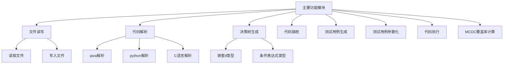
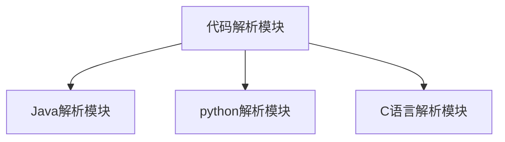
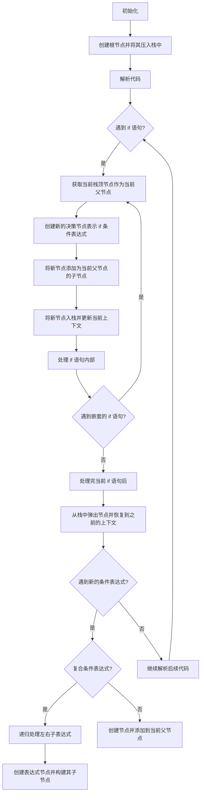
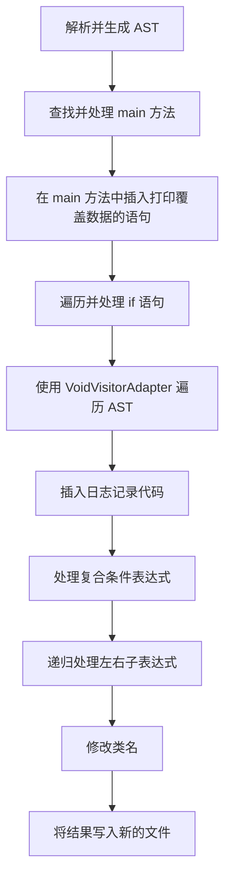
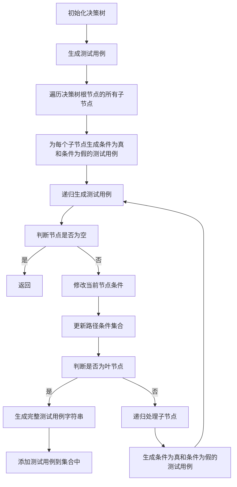
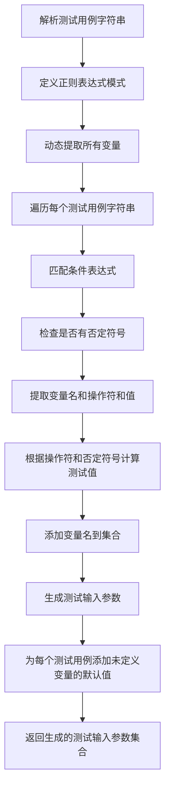
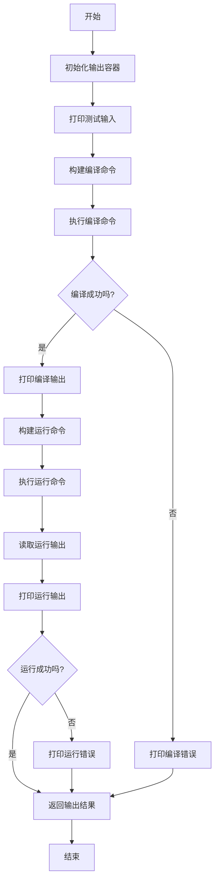
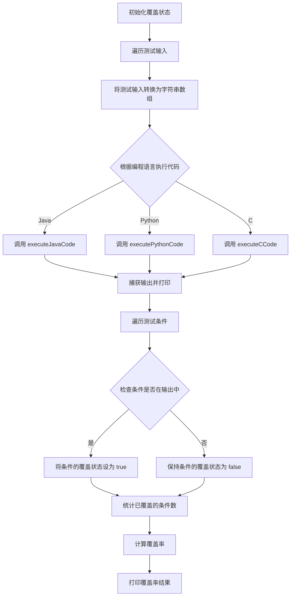

# MCDC覆盖及测试系统
本项目为编写一套 代码MCDC覆盖测试及分析系统，支持Java,Python以及C语言，会对待测代码依次进行 解析代码→生成决策树→代码插桩→生成测试用例→测试用例参数化→执行测试用例→输出MCDC覆盖率结果的操作

## 目录

- [1 运行方式](#1-运行方式)
- [2 MCDC处理各模块详细讲解](#2-MCDC处理各模块详细讲解)
  - [2.1 文件读写模块](#21-文件读写模块)
  - [2.2 代码解析模块](#22-代码解析模块)
    - [2.2.1 Java代码解析模块](#221-Java代码解析模块)
    - [2.2.2 python代码解析模块](#222-python代码解析模块)
    - [2.2.3 C语言代码解析模块](#223-C语言代码解析模块)
  - [2.3 决策树生成模块](#23-决策树生成模块)
    - [2.3.1 1. 栈的使用](#231-1-栈的使用)
    - [2.3.2 2. 处理嵌套的 if 语句](#232-2-处理嵌套的-if-语句)
    - [2.3.3 3. 条件表达式的处理](#233-3-条件表达式的处理)
  - [2.4 代码插桩模块](#24-代码插桩模块)
  - [2.5 测试用例生成模块](#25-测试用例生成模块)
  - [2.6 参数化测试用例模块](#26-参数化测试用例模块)
  - [2.7 代码执行模块](#27-代码执行模块)
    - [2.7.1 Java代码执行逻辑](#271-Java代码执行逻辑)
  - [2.8 MCDC覆盖率计算模块](#28-MCDC覆盖率计算模块)

## 1 运行方式

1. 将项目克隆到本地

2. 配置pom，从Maven仓库安装所需依赖

   

3. 进入`generator` 包中的`MCDCAnalyzer` 类

   

4. 配置待测试代码的路径和代码语言（共支持`Java`,`python`,`C语言`）

   

5. example包中已经配置好了部分测试用例，可以直接使用，本项目对于java代码的MCDC覆盖率计算支持比较好

   

6. 运行`MCDCAnalyzer` 类，会依次进行：解析代码→生成决策树→代码插桩→生成测试用例→测试用例参数化→执行测试用例→输出MCDC覆盖率结果

   

   

   

   

7. 插桩后的代码会在原文件名后加`_deal` 保存在example包下，编译后的可执行文件也在这个

   

## 2 MCDC处理各模块详细讲解

决策树生产，代码插桩，测试用例生成与参数化，代码执行，MCDC覆盖率计算为模块核心功能，均支持`Java`，`python`和`C语言`代码的处理。

### 2.1 文件读写模块

- InputOutPut
  - CodeReader
  - CodeWriter

文件解析模块如下：

其中：

|            |                                                              |
| ---------- | ------------------------------------------------------------ |
| CodeReader | 读取指定文件路径的文件内容，并返回文件内容的字符串形式。需要提供参数`filePath` 文件的路径，可以是相对路径或绝对路径；`return` 将会返回文件的全部内容,以字符串的形式呈现。 |
| CodeWriter | 将指定的内容写入到指定路径的文件中。此方法会创建新文件或覆盖已存在的文件。如果目标文件所在的目录不存在，将抛出 IOException。需要提供参数`filePath` 文件的路径，路径可以是相对路径或绝对路径，如果路径是相对路径，则相对于当前工作目录。还需要提供参数`content` 要写入文件的内容，该内容将被转换为字节序列并写入文件。 |

### 2.2 代码解析模块

本项目支持Java,python和C语言的代码解析。

#### 2.2.1 Java代码解析模块

1. **解析代码**：使用 `StaticJavaParser` 解析给定的 Java 代码字符串，生成 `CompilationUnit` 对象。
2. **添加 import 语句**：在 `CompilationUnit` 对象中添加 `com.example.CodeInstrumentor` 的 import 语句。
3. **查找 main 方法**：在所有类中查找包含 `main` 方法的类，并找到 `main` 方法。
4. **添加打印语句**：在 `main` 方法的最后添加 `System.out.println(com.example.CodeInstrumentor.getCoverageDataString());` 语句。
5. **访问 If 语句**：使用 `VoidVisitorAdapter` 访问所有的 `IfStmt`，并为每个条件表达式插入日志代码。
6. **处理 BinaryExpr**：对于逻辑运算符 `AND` 和 `OR` 的表达式，递归处理其子表达式，并将每个表达式添加到决策树中。
7. **修改类名**：将所有类的名称后缀加上 `_deal`。
8. **写入文件**：将修改后的代码写入新的文件。

#### 2.2.2 python代码解析模块

1. **调用外部Python脚本**：通过 `ProcessBuilder` 调用外部Python脚本 `parse_python.py`。
2. **传递代码给Python脚本**：通过进程的输入流将Python代码传递给Python脚本。
3. **等待Python脚本执行完成**：使用 `process.waitFor()` 等待Python脚本执行完成。
4. **读取Python脚本输出**：通过进程的输出流读取Python脚本的输出，该输出是一个JSON字符串，表示决策树。
5. **解析JSON输出**：将读取到的JSON字符串解析为 `JSONObject`。
6. **生成决策树**：调用 `buildDecisionTree` 方法将 `JSONObject` 构建为决策树。
7. **进行代码插桩**：调用 `insertPythonInstrumentationCode` 方法插入代码插桩。
8. **写入文件**：将插桩后的代码写入新的文件。

#### 2.2.3 C语言代码解析模块

- **解析代码**：使用 ANTLR 解析给定的 C 代码字符串，生成 `ParseTree` 对象。
- **生成决策树**：定义并使用 `CLanguageBaseListener` 遍历 `ParseTree`，在遇到 `if` 语句时，生成相应的决策节点并添加到决策树中。
- **代码插桩**：调用 `insertCInstrumentationCode` 方法进行代码插桩。
- **写入文件**：将插桩后的代码写入新的文件。

### 2.3 决策树生成模块

本项目的决策树生成模块支持生成`简单的if语句`，`复杂嵌套的if语句`以及`条件表达式`，处理逻辑如下：

#### 2.3.1 1. 栈的使用

栈（`Stack`）在处理嵌套结构时非常有用。对于嵌套的 `if` 语句，栈可以帮助我们跟踪当前的上下文节点，以便在离开嵌套时能正确地返回到之前的节点。

1. **压入栈**：当进入一个新的 `if` 语句时，创建一个新的节点并将其压入栈中。
2. **弹出栈**：当处理完当前的 `if` 语句时，从栈中弹出节点，恢复到之前的上下文。

#### 2.3.2 2. 处理嵌套的 `if` 语句

在解析代码时，遇到 `if` 语句时，需要将其条件表达式添加到当前节点的子节点中，并递归处理其子节点。通过使用栈，可以方便地管理当前的上下文节点，确保在处理嵌套结构时能够正确地维护树形结构。

1. **进入 ****`if`**** 语句**：
   - 当解析器遇到 `if` 语句时，会创建一个新的决策节点。
   - 将新节点添加为当前节点的子节点。
   - 将新节点压入栈中，更新当前上下文。
2. **离开 ****`if`**** 语句**：
   - 在处理完当前的 `if` 语句后，从栈中弹出节点。
   - 恢复到之前的上下文节点，继续处理后续的代码。

#### 2.3.3 3. 条件表达式的处理

条件表达式可以是简单的单一条件，也可以是复合条件（例如 `&&` 和 `||`）。处理条件表达式时，需要将每个条件表达式解析为相应的决策节点，并构建其树形结构。

1. **简单条件表达式**：
   - 对于简单的条件表达式，直接创建一个决策节点，并将其添加到当前节点的子节点中。
2. **复合条件表达式**：
   - 对于复合条件表达式（例如 `&&` 和 `||`），需要递归处理每个子表达式。
   - 创建一个新的表达式节点，将其添加到当前节点的子节点中。
   - 递归处理左、右子表达式，将每个子表达式解析为决策节点，并添加到表达式节点中。

### 2.4 代码插桩模块

代码插桩模块流程图如下：

**主要步骤：**

1. **解析并生成 AST**：使用 `JavaParser` 解析 Java 代码，并生成抽象语法树。
2. **查找并处理 ****`main`**** 方法**：在 `main` 方法中插入打印覆盖数据的语句。
3. **遍历并处理 ****`if`**** 语句**：使用 `VoidVisitorAdapter` 遍历 AST 中的所有 `if` 语句，并插入日志记录代码。
4. **处理复合条件表达式**：递归处理复合条件表达式，确保所有条件表达式都记录日志。
5. **修改类名并写入文件**：修改类名以区分原始代码和插桩后的代码，并将结果写入新的文件。

### 2.5 测试用例生成模块

测试用例生成模块的执行流程图如下：

此模块在代码中的位置：

**逻辑**：

1. **判断节点是否为空**：如果当前节点为空，则返回。
2. **修改当前节点条件**：根据真值 (`truthValue`) 修改当前节点的条件，形成新的条件表达式。
3. **更新路径条件集合**：将修改后的条件添加到新的路径条件集合中。
4. **叶节点处理**：如果当前节点是叶节点，生成完整的测试用例字符串，并添加到测试用例集合中。
5. **递归处理子节点**：如果当前节点有子节点，递归调用 `generateMCDCases` 方法，分别生成条件为真和条件为假的测试用例。

### 2.6 参数化测试用例模块

参数化测试用例模块的流程图如下：

此模块在代码中所处的位置为：

**主要逻辑：**

1. **解析测试用例字符串**：
   - 使用正则表达式解析包含逻辑条件的字符串，提取变量、操作符和值。
   - 根据操作符和是否存在否定符号，计算相应的测试输入值。
2. **生成测试输入参数**：
   - 为每个测试用例生成变量和值的映射。
   - 为未定义变量添加默认值。

### 2.7 代码执行模块

#### 2.7.1 Java代码执行逻辑

1. **初始化输出容器**：
   - 创建一个 `StringBuilder` 对象用于累积程序执行的输出。
2. **打印测试输入**：
   - 打印传递给 Java 程序的命令行参数。
3. **构建编译命令**：
   - 使用 `javac` 命令编译指定路径的 Java 源代码文件。
   - 命令格式为 `javac <filePath>`。
4. **执行编译命令**：
   - 使用 `Runtime.getRuntime().exec` 方法执行编译命令。
   - 等待编译过程完成并检查其输出和错误信息。
5. **构建运行命令**：
   - 构建运行 Java 类的命令，命令格式为 `java -cp <classPath> <className>`。
   - 包含类路径（即源代码所在目录）和类名（从文件路径中提取）。
   - 如果有传递命令行参数，则将其添加到运行命令中。
6. **执行运行命令**：
   - 使用 `Runtime.getRuntime().exec` 方法执行运行命令。
   - 读取运行过程的输出，将其追加到 `StringBuilder` 对象中。
   - 等待运行过程完成并检查其输出和错误信息。
7. **异常处理**：
   - 捕获并处理 `IOException` 和 `InterruptedException` 异常，打印异常信息。
8. **返回结果**：
   - 返回累积的程序执行输出。

### 2.8 MCDC覆盖率计算模块

- **覆盖状态初始化**：`coverage` Map 初始化所有条件为 `false`。
- **执行代码并捕获输出**：根据编程语言执行相应的代码，并捕获输出。
- **检查覆盖状态**：遍历 `testCases`，如果 `output` 中包含 `condition`，则将该条件的覆盖状态设为 `true`。
- **计算覆盖率**：统计覆盖的条件数，并计算覆盖率百分比。
- **打印覆盖率**：输出最终的覆盖率结果。
